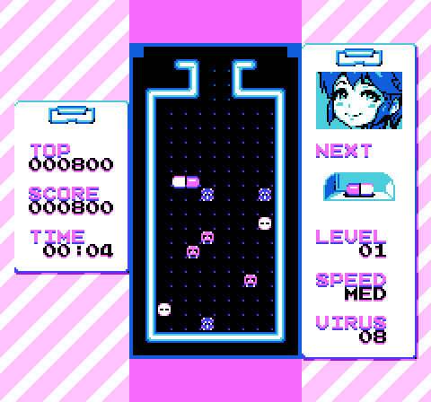
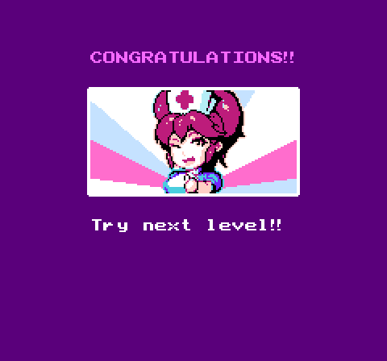
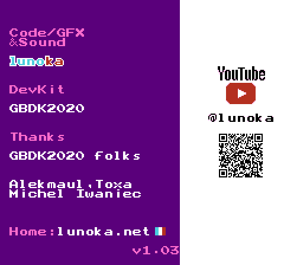

  

<h1 align="center">PopNES</h1>

  
  

  
  
   
  
  

画面は lunoka 氏の <a href="https://lunoka.itch.io/mai-nurse">「Mai Nurse」</a> を PopNES の x1(等倍)表示で動かしたものです(作者の許可を得て掲載。下の「クレジット」を参照)。

**非公式の改変版です。** PopNES は、ファミコン / NES のエミュレータ [QuickNES](https://github.com/libretro/QuickNES_Core)(Shay Green 氏(blargg)作)の libretro 版を、SHARP の電子辞書 Brain PW-G5200(Windows CE)向けに移植した**非公式**の改変版です。QuickNES の公式版ではありません。QuickNES の作者や libretro のメンテナーはこの移植に関わっておらず、サポートもしていません。不具合の報告は、上流ではなくこちらにお願いします。

**Unofficial port.** PopNES is an unofficial port of the libretro edition of QuickNES (by Shay Green "blargg" and contributors) to the SHARP Brain PW-G5200 (Windows CE). It is not an official QuickNES release, and the QuickNES authors and libretro maintainers are not involved in it and do not support it. Please report PopNES issues here, not upstream. PopNES is distributed under the same terms as upstream, GPL-2.0.

## ダウンロード
最新版は Releases のページからダウンロードできます。
https://github.com/daizu-coder/PopNES/releases/latest

## アプリのインストール
Brainへのインストールは[アプリの起動方法](https://brain.fandom.com/ja/wiki/アプリの起動方法)を参照してください。

ファミコン / NES のゲーム(`.nes`)を SD カードに置き、アプリのメニューの「ROMを開く」から選んでください。セーブ(`.srm`)とステート(`.state`)は、ゲームと同じフォルダに作られます。

対応しているマッパーは 55 種類です。次のものには対応していません：ディスクシステム(.fds)、UNIF(.unf)、.zip、NES 2.0 の拡張情報、PAL 版のゲーム、MMC5 の拡張音源、ザッパーなどの周辺機器。

## 制作について
コードとマスコットの絵はAI(Claude)で作りました。製作者はプログラムを読めません。

## ライセンスと商標
PopNES 全体は、上流と同じ条件(GPL-2.0)で配布します。PopNES の自作部分は MIT ライセンス、マスコットの絵とアイコンは CC0 1.0 です。上流のファイルには、ファイルごとに LGPL-2.1 以降、GPL-2.0 以降、MIT などの表記があります。作者の名前やライセンスの表記がないファイルは、上流リポジトリの `LICENSE`(GPL-2.0)に従います。詳しくは [CE/LICENSING.md](../CE/LICENSING.md) をご覧ください。

「任天堂」「ファミリーコンピュータ」「ファミコン」「NES」は任天堂株式会社の商標、「SHARP」「Brain」はシャープ株式会社の商標です。PopNES は、任天堂、シャープなどの権利者とは関係ありません。

ゲームの ROM は同梱していません。

サブモジュールは使っていないので、`git clone` でも「Download ZIP」でもビルドできます。

**使い方やビルドの説明は [CE/README.md](../CE/README.md)、ライセンスの詳しい説明は [CE/LICENSING.md](../CE/LICENSING.md) にあります。**

このリポジトリは、上流の [libretro/QuickNES_Core](https://github.com/libretro/QuickNES_Core) のコミット `26bb785` を元にしています。上流のファイルは変えていません。

## クレジット

PopNES は、次の方々の作品を使わせていただいています。ありがとうございます。

- **QuickNES**(エミュレータ本体):Shay Green 氏(blargg)の Nes_Emu、Nes_Snd_Emu、Blip_Buffer、nes_ntsc と、libretro 版を保守する libretro のコントリビューター。上流は [libretro/QuickNES_Core](https://github.com/libretro/QuickNES_Core) です。Shay Green 氏のファイルは LGPL-2.1 以降、全体は GPL-2.0 です。
- **マッパー 021、022、023、025(Konami VRC2 / VRC4)**:Shay Green 氏、CaH4e3 氏。上流のコメントによると、FCEUX のコードをもとにしたものです。GPL-2.0 以降。
- **MMC5(マッパー5)**:拡張属性の読み出しは、上流のコメントによると FCEUmm(GPL-2.0)の実装にならったものです。FCEUX / FCEUmm の開発者の皆さんに感謝します。
- **emu2413**(YM2413 / VRC7 の FM 音源):Mitsutaka Okazaki 氏。VRC7 向けの改変は xodnizel 氏。商用を含めて自由に使うことを許していただいています。
- **libretro API のヘッダ、libretro-common の一部**:The RetroArch team。MIT ライセンス。
- **東雲フォント(16ドット)**(画面の文字):古川泰之氏ほか、/efont/(電子書体オープンラボ)。実質パブリックドメイン。
- **Galmuri フォント**(画面の文字):Lee Minseo 氏([quiple/galmuri](https://github.com/quiple/galmuri))。SIL Open Font License 1.1。
- **マスコットの絵とアイコン**:Pop シリーズのマスコットをもとに、AI(Claude)で作りました。CC0 1.0(パブリックドメイン)。
- **スクリーンショットのゲーム**:[「Mai Nurse(NES 版)」](https://lunoka.itch.io/mai-nurse)、作者は lunoka 氏です。作者の許可を得て、この README に掲載しています。スクリーンショットの画像(`.github/screenshots/`)は、このリポジトリのライセンス(GPL-2.0、MIT、CC0 1.0)の対象外で、ゲームの著作権は作者にあります。

それぞれの著作権表示とライセンスの全文は [CE/THIRDPARTY_LICENSES.txt](../CE/THIRDPARTY_LICENSES.txt) にあります。
